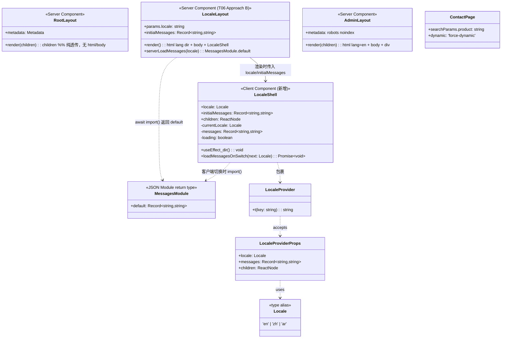

# R2 高风险项增量架构设计 + 任务分解（T06 / T07 / T08）

> 编制：架构师 高见远（software-architect）
> 依据：`docs/audit/perf-seo-fix-plan-2026-07-23.md`（第 0 节铁律、1.1 / 1.5 / 1.6、任务表 T06/T07/T08、第 3 节）
> 实地核对：已 Read 三个布局文件、`src/lib/i18n.tsx`、`src/lib/seo.ts`、`[locale]` 全部 15 个 page.tsx、grep 全仓 `headers()/cookies()/no-store`、globals.css 全量 `@keyframes`。HEAD=9abb689，working tree 干净，stash@{0} 仅作参考未触碰。
> 性质：纯增量设计，未改动任何文件。以下为给工程师直接可用的设计文本。
> 主理人决策（2026-07-23）：**T06 走 Approach B 为主路径 + 门控 2（seo.ts 去 headers）+ T07 服务端动态 import + T08 组件级 import；next build 拒绝则自动回退 A。**

---

## 0. 铁律合规声明（本设计对三项均遵守）

| 铁律 | T06 合规点 | T07 合规点 | T08 合规点 |
|---|---|---|---|
| 1 布局零改动 | `[locale]` 的 `<body>` className **逐字沿用**现有 `flex min-h-screen flex-col bg-slate-50 text-ink-800 antialiased`；DOM 层级不变，仅把 `<html>/<body>` 从根布局"下沉"到 [locale] 布局 | 仅改 messages 加载方式，DOM/布局零改动 | 仅文件切分，**类名/`@keyframes`/动画逻辑一字不改** |
| 2 品牌动画禁区 | 不涉及动画 | 不涉及动画 | 禁区类（fireworks/glacier/clouds/footer-fireflies/card pulse/Starfield/AuroraBackground/OceanBubbles/CTA 各场景）**全部留在 globals.css 原样**，仅抽取非禁区、非首屏动画 |
| 3 字体优先级 | 字体 `<link>` 保持原 `FONT_URL` 与字重，不改观感 | 同左 | 同左 |
| 4 图片零位移 | 不涉及 | 不涉及 | 切分不改变任何布局/尺寸，零 CLS |
| 5 不动业务功能 | 仅移除 `headers()` / 改渲染模式 / 加 `revalidate`，业务函数不碰 | 仅 i18n messages 加载，t() 语义不变 | 仅 CSS 位置，逻辑不变 |

---

## 1. 实现方案与框架选型

### 1.1 T06 — 根布局移除 `headers()` + `html` 下沉 + 内容页 ISR

**选型：Approach B（推荐，next-intl 官方模式）为主路径；Approach A 为回退。**

经核实，`headers()` 在全仓仅两处：
- `src/app/layout.tsx:42`（`resolveLocale()` 内，**本项移除**）；
- `src/lib/seo.ts:27`（`getBaseUrl()` 内，**关键前置门控，见下**）。

全仓**无 `cookies()`**、**无 `no-store`/`unstable_noStore`/`cache:`**（仅在 `api/build-info`、`BuildVersionChecker`、`middleware`，均不在页面渲染/数据路径）。因此移除根布局 `headers()` 后，9 个内容页已无动态渲染死锁点，可 ISR。**唯一剩余死锁点 = `getBaseUrl()` 的 `headers()`**。

#### 🔴 硬前置门控（GO / NO-GO）
`generateMetadata` 在每个 `[locale]` 页都调用 `getBaseUrl()`（seo.ts L108/199/223/260/277/299）。`getBaseUrl()` 逻辑（L21-37）：`if (process.env.NEXT_PUBLIC_BASE_URL) return ...`（**不触发 headers()**）；仅当该变量**未设置**时才 `headers()` → 强制全站动态 → ISR 失败。
- **门控 1（环境）**：部署/构建环境的 `.env` 必须设置 `NEXT_PUBLIC_BASE_URL`（`.env.example` 已含）。
- **门控 2（代码加固，强烈建议，来自 1.2 防御性增强）**：将 `getBaseUrl()` 改为**只依赖 `NEXT_PUBLIC_BASE_URL`**，删除 `headers()` 回退分支（`return process.env.NEXT_PUBLIC_BASE_URL?.replace(/\/+$/,'') ?? ''`）。零风险，使 ISR 不依赖环境变量是否存在，确定性落地。
- **结论**：T06 落地前必须先满足门控 1 或门控 2。本设计将门控 2 作为 T06 的**必要配套改动**写入文件列表（避免 T06 因环境变量缺失而静默失败）。

#### `next build` 验收阈值（必须通过才上线）
- 构建**必须成功**，无 "html/body" 相关报错。
- `next build` 输出中，下列 9 页须标记为 **`○ (ISR)` / `● (SSG)`**，**不得**为 `λ (Dynamic)`：
  `/en`、`/zh`、`/ar`、`/en/about`、`/zh/about`、`/ar/about`、`/en/products`、`/en/blog`、`/en/solutions`、…（全部 `[locale]` 静态内容页）。
- 三语首页首字节 HTML 的 `<html lang=... dir=...>` 正确：`/ar` → `lang="ar" dir="rtl"`，`/zh` → `lang="zh" dir="ltr"`，`/en` → `lang="en" dir="ltr"`，**无 RTL 闪动**。
- 不添加 `generateStaticParams`（避免构建期访问 DB；采用**按需 ISR**，首请求渲染并缓存 300s，构建无需 DB）。

#### 回退触发条件（→ Approach A）
若 `next build` 拒绝根透传（报 html/body 缺失/重复，或 9 页仍标 Dynamic），则：
- 根布局保留静态 `<html lang="en" dir="ltr">` + `<body className=...>`（**不再用 headers() → 根变静态**）；
- `[locale]/layout.tsx` **不渲染** html/body，沿用现有客户端 `useEffect` 修正 `ar` 的 `dir`；
- `xiaozhouBackend/layout.tsx` **无需改动**（根已提供 html/body）；
- 9 个内容页仍改 `revalidate=300`（根静态 + 无 headers → 仍 ISR）。
- 代价：仅 `/ar` 首字节 `lang` 为 `en`，hydration 后切 RTL（观感次优但零构建风险、不改观感）。

> **架构建议（重要）**：当前 `[locale]/layout.tsx` 是 `'use client'`。若 T06 让其直接渲染 `<html>/<body>`，虽 Next 14.2 允许（精确约束是"整棵树恰好一个 html/body"，非"仅根可含"），但**将 `[locale]/layout.tsx 转为 Server Component** 渲染 html/body 是 next-intl 官方更标准、构建风险更低的形式，且能天然支撑 T07 的"服务端按 locale 加载 messages"。建议 T06 直接采用 **Server Component 版 [locale]/layout**（见 §3/§4），T07 在其上追加服务端动态 import。

#### contact 页处理
`[locale]/contact/page.tsx` 用 `searchParams: { product?: string }` → App Router 中必动态。**保持 `force-dynamic` 不变**（已是动态，非回归）。

### 1.2 T07 — i18n messages 按 locale 动态 import

当前 `[locale]/layout.tsx` 静态 `import` 三语 `messages/*.json`（en 22.5KB / zh 22.0KB / ar 28.3KB，合计 ~73KB）注入 `LocaleProvider` → 全进客户端包。

**加载态方案（推荐 Opt-A，SEO 安全）**：结合 §1.1 的 Server Component 版 `[locale]/layout`：
- **首屏（SSR）**：Server `[locale]/layout` 依 `params.locale` **服务端** `const initialMessages = (await import(\`@/messages/${locale}.json\`)).default`，随 RSC 下发。初始 HTML 即含**正确语种文案** → **无英文 FOUC、SEO 文本在首屏 HTML 中**。客户端包仅含当前语种（按需 chunk），不再静态打包三语。
- **客户端语种切换**：本站点 i18n 为 URL 前缀式（`/zh/...`），切换 = 导航 → Server 重渲染带新 `locale` 的 messages，**无闪动**。若个别场景为原地切换，`LocaleShell` 的 `useEffect` 对目标 locale 做 `import()`，期间渲染**骨架占位**（仅占位、不显示英文文案），加载完再换 `messages`。

**动态 import 返回类型契约**：`import(\`@/messages/${locale}.json\`)` → `Promise<{ default: Record<string, string> }>`（JSON Module，取 `.default`）。

### 1.3 T08 — globals.css 拆分

`globals.css` 2106 行 / ~80KB。**仅做文件切分，禁区类一字不改**（铁律 2）。

**切分边界原则**：
- **留在 `globals.css`（原样，不碰）**：Tailwind 三层、`@tailwind`、reset/base、布局工具类、**全部禁区品牌动画**、以及**首屏动画**。
- **抽到新文件 `src/styles/animations-deferred.css`（纯 CSS，非 CSS Module）**：仅**非禁区 + 非首屏（below-the-fold）**的装饰动画 keyframes 与其 class 块，例如 `villageStar/windowGlow/moonGlow`、`floatSlow/floatGentle/slideUpFade`、`iconFloatY/iconShimmer`、`pillPulse/rippleRing/waterRippleExpand/godRaySway/flowBar/spinSlow` 等。**每块整体搬迁，类名/`@keyframes`/逻辑一字不改**。
- **为何不用 CSS Module（*.module.css）**：CSS Module 会**哈希类名**，对禁区类违反"一字不改"，对非禁区类需同步改 JSX 引用（`styles.x`）→ 增大"丢类名"风险。故 T08 用**普通 CSS 分块**（`@import` 或组件级 `import`）以保证类名零变化。
- **首屏体积下降的关键**：`animations-deferred.css` **不得**在根/首屏布局 import，而由**使用它的下方组件** `import '@/styles/animations-deferred.css'`。这样该 CSS 随下方组件按需加载，首屏 CSS 下降。
- **逐类核对（风险点）**：每搬一个 `@keyframes`+其 class 块，必须 `grep -rn "className=\"<类名>\"" src` 确认其消费组件 import 了新分块；搬完后 `next build` + 视觉回归确认所有动画（含禁区）照常运行、无类名丢失。

---

## 2. 文件列表（相对仓库根 `qtechvending-local/`）

**T06（Approach B，Server Component 版 [locale]/layout）**
- `M src/app/layout.tsx` — 根改为纯透传 `return children`；删除 `import { headers }`、`VALID_LOCALES`、`resolveLocale()`、`escapeForInlineScript`、`BUILD_ID` 常量与 script；保留 `export const metadata` 与 `import './globals.css'`。
- `M src/app/[locale]/layout.tsx` — 转 **Server Component**；渲染 `<html lang={activeLocale} dir={activeLocale==='ar'?'rtl':'ltr'} suppressHydrationWarning><body className="flex min-h-screen flex-col bg-slate-50 text-ink-800 antialiased">…</body></html>`；把 BUILD_ID `<script>` 与 `<BuildVersionChecker />` 移入 `<body>` 内（**必须位于 body 内**）；将 Navbar/Footer/JsonLd/字体 `<link>`/LocaleProvider/原 dir `useEffect` 委托给新 `LocaleShell` 客户端组件；`initialMessages` 静态 import（T07 再改动态）。
- `A src/components/LocaleShell.tsx` — **新增**客户端组件：接收 `locale`/`initialMessages`/`children`；持有 `currentLocale`、`messages` state + dir `useEffect`；渲染 `LocaleProvider` + 字体 `<link>` + `JsonLd` + `Navbar` + `<main>{children}</main>` + `Footer` + `BackToTop`（DOM 层级与现有完全一致）。
- `M src/app/xiaozhouBackend/layout.tsx` — 补 `<html lang="en"><body className="min-h-screen bg-slate-100 text-ink-800">…</body></html>`，内部保留现有 `<div>`。admin `noindex`，影响极低。
- `M src/app/[locale]/page.tsx`（首页）、`about`、`blog`、`blog/[slug]`、`category/[slug]`、`faq`、`products`、`products/[...slug]`、`solutions` 共 **9 个 page.tsx** — `export const dynamic = 'force-dynamic'` → `export const revalidate = 300`。
- `src/app/[locale]/contact/page.tsx` — **不改**（保留 `force-dynamic`，因 `searchParams`）。
- `M src/lib/seo.ts` — **必要配套（门控 2）**：`getBaseUrl()` 删除 `headers()` 回退分支，仅 `return process.env.NEXT_PUBLIC_BASE_URL?.replace(/\/+$/,'') ?? ''`（移除 `import { headers }`）。

> 注：若选 Approach A 回退，则 `src/app/[locale]/layout.tsx` 不渲染 html/body、`xiaozhouBackend/layout.tsx` 不改、`layout.tsx` 根保留静态 html/body；其余 9 页 `revalidate=300` 与 seo.ts 改动不变。

**T07**
- `M src/app/[locale]/layout.tsx` — 将 `initialMessages` 由静态 import 改为**服务端动态 import**：`const initialMessages = (await import(\`@/messages/${locale}.json\`)).default`；传入 `LocaleShell`。
- `M src/components/LocaleShell.tsx` — 增加客户端语种切换的 `import(\`@/messages/${nextLocale}.json\`)` + 加载态（骨架占位）逻辑（Opt-A 主路径；原地切换场景）。

**T08**
- `M src/app/globals.css` — 删除已抽走的"非禁区 + 非首屏"动画块（其余原样）；禁区与首屏动画**一字不改**。
- `A src/styles/animations-deferred.css` — 新增，承载抽出的下方动画块（纯 CSS，类名不变）。
- `M` 各消费组件（如 `VillageScene`/`StatsBand`/相关首屏下 section）→ 增加 `import '@/styles/animations-deferred.css'`（具体文件在抽取时由 grep 用法确定）。

---

## 3. 数据结构与接口（Mermaid classDiagram）



**契约要点**
- `LocaleProvider` 接口**不变**：`{ locale: Locale; messages: Record<string,string> }`（`src/lib/i18n.tsx`）。`t()` 语义不变。
- `MessagesModule = { default: Record<string, string> }`：动态 `import(\`@/messages/${locale}.json\`)` 的返回类型（JSON Module 取 `.default`）。
- `LocaleShell` props：`{ locale: Locale; initialMessages: Record<string,string>; children: ReactNode }`。SSR 用 `initialMessages`（正确语种，无 FOUC）；客户端切换调用 `loadMessagesOnSwitch`。

---

## 4. 程序调用流程（Mermaid sequenceDiagram）

### 4.1 T06 — html/body 归属 + ISR 渲染时序

```mermaid
sequenceDiagram
    participant MW as middleware
    participant RL as RootLayout (Server, 透传)
    participant LL as [locale]/layout (Server)
    participant DB as Prisma/DB
    participant PG as Page (ISR, revalidate=300)
    participant SH as LocaleShell (Client)
    Note over MW: 注入 x-pathname（T06 后不再被消费，可保留）
    MW->>RL: 请求 /ar/about
    RL->>LL: 透传 children（无 headers()）
    LL->>LL: activeLocale = params.locale ('ar')
    LL->>LL: serverLoadMessages('ar') → initialMessages
    LL->>SH: 传 locale='ar', initialMessages
    SH->>SH: 首屏渲染 LocaleProvider(messages=ar)
    Note over LL: 渲染 <html lang="ar" dir="rtl"><body className=...>
    LL->>PG: 渲染页面
    PG->>DB: getSiteSetting()/getCategories()…（无 cookies/headers）
    DB-->>PG: 数据（按 revalidate=300 缓存 300s）
    PG-->>LL: HTML（ISR 缓存）
    Note over RL,SH: 首字节即含正确 lang/dir → 无 RTL 闪动
    SH->>SH:  hydration; useEffect 设 document.documentElement.lang/dir（与 SSR 一致，无 mismatch）
```

### 4.2 T07 — 动态 import 加载态时序

```mermaid
sequenceDiagram
    participant SSR as [locale]/layout (Server)
    participant SH as LocaleShell (Client)
    participant JSON as @/messages/${locale}.json (chunk)
    Note over SSR: 首屏（SSR）
    SSR->>JSON: await import(`@/messages/${params.locale}.json`)
    JSON-->>SSR: { default: messages }
    SSR->>SH: initialMessages（正确语种随 RSC 下发）
    SH->>SH: 渲染 LocaleProvider(messages=initialMessages)
    Note over SH: 首屏 HTML 含正确语种文案 → 无英文 FOUC，SEO 文本在首屏
    Note over SH: 客户端原地语种切换（罕见路径；URL 式切换走导航→SSR 重渲染）
    SH->>SH: currentLocale 变更
    SH->>SH: setLoading(true) → 渲染骨架占位（不显示英文）
    SH->>JSON: import(`@/messages/${nextLocale}.json`)
    JSON-->>SH: { default: nextMessages }
    SH->>SH: setMessages(nextMessages); setLoading(false)
    SH->>SH: LocaleProvider 更新 → 文案切换完成（零英文闪动）
```

---

## 5. 任务列表（有序、含依赖、风险、改动要点、验证）

> 风险：🔴 高（需构建验证/门控）｜🟠 中（观感/逐类核对敏感）｜🟡 低

### T06 — 根布局透传 + html 下沉 + 内容页 ISR　【风险 🔴】
- **依赖**：无（地基项，先行）。
- **前置门控**：满足 §1.1 门控 1（`NEXT_PUBLIC_BASE_URL` 已设）**或**门控 2（seo.ts `getBaseUrl()` 去 `headers()`）。本任务内含门控 2 改动。
- **文件**：`src/app/layout.tsx`、`src/app/[locale]/layout.tsx`、`src/components/LocaleShell.tsx`(新)、`src/app/xiaozhouBackend/layout.tsx`、`src/lib/seo.ts`、9 个 `[locale]/**/page.tsx`、`contact/page.tsx`(不改)。
- **改动要点**：
  1. `layout.tsx` 根：删 `headers`/`VALID_LOCALES`/`resolveLocale`/`escapeForInlineScript`/`BUILD_ID`，`RootLayout` 改 `return children`；保留 `metadata` + `import './globals.css'`。
  2. `[locale]/layout.tsx`：转 Server Component；`BUILD_ID`/`escapeForInlineScript` 常量迁至此；渲染 `<html lang={activeLocale} dir={activeLocale==='ar'?'rtl':'ltr'} suppressHydrationWarning><body className="flex min-h-screen flex-col bg-slate-50 text-ink-800 antialiased">` + BUILD_ID `<script>` + `<LocaleShell>` + `<BuildVersionChecker />`（**script/Checker 必须在 body 内**）。
  3. 新增 `LocaleShell.tsx`（client）：承接 `LocaleProvider` + 字体 `<link>` + `JsonLd` + `Navbar` + `<main>{children}</main>` + `Footer` + `BackToTop` + dir `useEffect`（className 与 DOM 层级与现完全一致）。
  4. `xiaozhouBackend/layout.tsx`：补 `<html lang="en"><body className="min-h-screen bg-slate-100 text-ink-800">`。
  5. 9 页：`force-dynamic` → `revalidate = 300`；`contact` 保持 `force-dynamic`。
  6. `seo.ts`：`getBaseUrl()` 去 `headers()` 回退（门控 2）。
- **验证**：`next build` 成功；9 页标 `○(ISR)`/`●(SSG)`，非 `λ(Dynamic)`；`curl` 三语首页首字节确认 `<html lang/dir>` 正确（尤其 `/ar` 无闪动）；视觉回归：布局/字体/动画无变化；admin 页正常（noindex）。
- **回退**：build 拒透传 → Approach A（§1.1 / §8）。

### T07 — i18n messages 按 locale 动态 import　【风险 🟠】
- **依赖**：T06（在 Server Component 版 `[locale]/layout` 上追加）。
- **文件**：`src/app/[locale]/layout.tsx`、`src/components/LocaleShell.tsx`。
- **改动要点**：
  1. `[locale]/layout.tsx`：`initialMessages` 由静态 import 改为服务端 `const initialMessages = (await import(\`@/messages/${locale}.json\`)).default`。
  2. `LocaleShell.tsx`：加 `loadMessagesOnSwitch(next)`（动态 `import()` + 骨架占位）；仅原地切换场景触发。
- **验证**：构建产物分析：单语种客户端包不再含另两语 JSON（体积降 ~70KB）；首屏 `view-source` 含正确语种文案（无英文 FOUC）；SEO 文本在首屏 HTML；客户端切换语种：仅骨架闪现、无英文文案闪动；动画/布局无变化。
- **回退**：FOUC/SEO 不可接受 → 回退静态 import（保留三语静态打包）。

### T08 — globals.css 非首屏动画抽 CSS 分块　【风险 🟠】
- **依赖**：无（独立，建议排在 T06/T07 之后）。
- **文件**：`src/app/globals.css`(改)、`src/styles/animations-deferred.css`(新)、相关消费组件(改)。
- **改动要点**：
  1. 从 globals.css 整体搬迁"非禁区 + 非首屏"动画块（keyframes+class）到 `animations-deferred.css`，**类名/`@keyframes`/逻辑一字不改**。
  2. 禁区品牌动画 + 首屏动画**留 globals.css 原样**。
  3. 由 grep 定位每类消费组件，在其内 `import '@/styles/animations-deferred.css'`（不在首屏布局 import）。
- **验证**：逐类 grep 确认每个搬走类名的消费组件已 import 新分块（无丢类名）；`next build` + 视觉回归：禁区动画照常运行；无样式缺失；首屏 CSS 体积（`du -h .next/static/css`）下降。
- **回退**：抽取致缺失/回归 → 还原到单 globals.css（纯位置变动，git 一键 revert）。

---

## 6. 依赖包列表

- **无新增第三方依赖。** T06/T07 的动态 `import()` 为 JS/Next.js 原生能力；T08 为纯 CSS 文件切分。现有栈已具备所需能力，无需 `next/font`。

---

## 7. 共享知识（跨文件约定，工程师务必遵守）

1. **`body` className 必须逐字一致**：`flex min-h-screen flex-col bg-slate-50 text-ink-800 antialiased`（铁律 1）。任何布局改动不得增删 Tailwind 布局类。
2. **禁区类名白名单（globals.css 中一字不改、不得移动）**：fireworks/glacier/clouds/footer-fireflies/card pulse/Starfield/AuroraBackground/OceanBubbles/CTA 各场景（详见 perf-seo-fix-plan 第 0 节与下方）。
   - fireworks：`.fireworks` + `@keyframes fireworkCore/fireworkParticle`
   - glacier：`.glacier*` + `@keyframes glacierAurora/glacierAurora2/glacierRay/glacierMist/glacierSparkle`
   - clouds：`.cta-sky__cloud` + `@keyframes skyCloudDrift`
   - footer-fireflies：`.footer-fireflies` + `@keyframes firefly/footerDrift/footerTwinkle`
   - card pulse：`.animate-pulse-border`/`.pulseBorderLine`、`.glass-ice.animate-pulse-border`、`.trust-shimmer`、`.glass-surface.pulse-soft`、`.card-beam-sweep`、`.stat-number-anim` + `@keyframes pulseBorderLine/trustShockSweep/pulseSoft/card-beam-sweep/statSheen/iconGlow/trustBorderPulse`
   - Starfield / AuroraBackground：`@keyframes auroraFlowA/B/C/D`
   - OceanBubbles：`@keyframes oceanWave/bubbleRise/waveShimmer`
   - CTA 各场景：`.cta-aqua`/`.cta-sunrise`/`.cta-bird`/`.portal-*` 相关 keyframes
   - **边界含糊类（宁可留 globals.css）**：`beam-sweep`(通用版) 与 `card-beam-sweep` 相邻，统一留在 globals.css。
3. **BUILD_ID `<script>` 与 `<BuildVersionChecker />` 必须位于 `<body>` 内**（T06 后从根迁移到 [locale] body）；admin 路由不强制（可接受缺失）。
4. **`getBaseUrl()` 门控**：T06 生效前必须保证 `getBaseUrl()` 不触发 `headers()`（环境变量已设 或 已去回退分支），否则全站 ISR 静默失败。
5. **不添加 `generateStaticParams`**：采用按需 ISR，避免构建期访问 DB。
6. **`[locale]/layout.tsx` 渲染 html/body 时加 `suppressHydrationWarning`**（dir 客户端微调时防 hydration 警告）。
7. **contact 页保持 `force-dynamic`**（消费 `searchParams.product`）。

---

## 8. 回退预案

- **T06 Approach B → A**：触发 = `next build` 拒绝根透传（html/body 报错）或 9 页仍标 `λ(Dynamic)`。步骤：根布局恢复静态 `<html lang="en" dir="ltr"><body className=...>`（无 headers()）；`[locale]/layout.tsx` 不渲染 html/body（沿用现有客户端 dir useEffect）；`xiaozhouBackend/layout.tsx` 不改；9 页仍 `revalidate=300`。零观感风险、零构建风险。
- **T07 FOUC/SEO 不可接受 → 回退静态 import**：`[locale]/layout.tsx` 恢复三语静态 `import` + `MESSAGES` map；删除 `LocaleShell` 的动态 `import()` 与骨架。代价：客户端包 +~70KB。
- **T08 抽取失败 → 回退单文件**：`git checkout` 还原 `globals.css` 与相关组件 import；`animations-deferred.css` 删除。

---

## 9. 主理人决策（2026-07-23，答复 §9 待明确事项）

1. **T06 采用 Server Component 版 `[locale]/layout`（Approach B 主路径）**：更贴近 next-intl 官方、SEO 更优（首屏 lang/dir 正确）、天然支撑 T07。若 `next build` 拒绝根透传则自动回退 Approach A。
2. **门控 2 必须做**：`seo.ts` 的 `getBaseUrl()` 删除 `headers()` 回退分支（确定性解耦，不依赖环境变量）。
3. **T08 采用组件级 `import`**（真正降首屏）。
4. **Approach A 作为回退默认**（非上线默认）**：B 为主、A 为回退闸门，与架构师一致。

*本设计为纯增量方案，未改动任何源码。所有改动须在遵守第 0 节「铁律」前提下、由工程师按 T06→T07→T08（T07 依赖 T06）顺序实施。*
