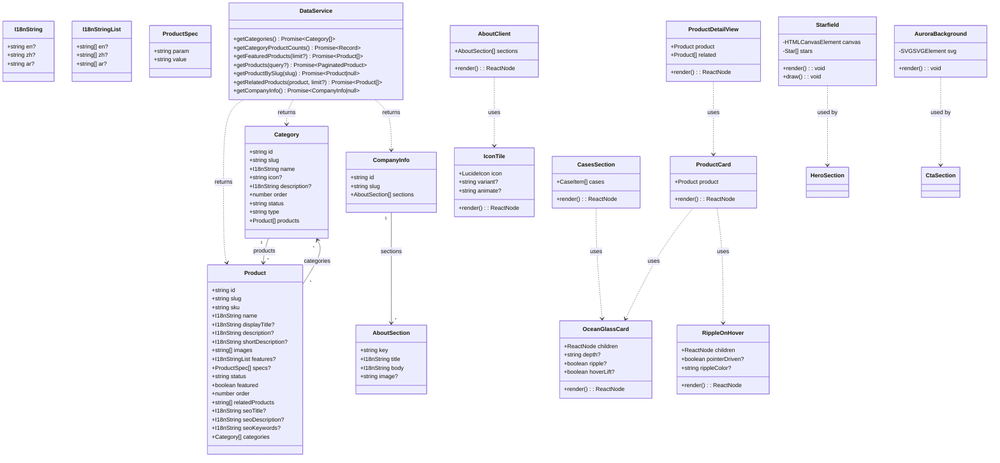
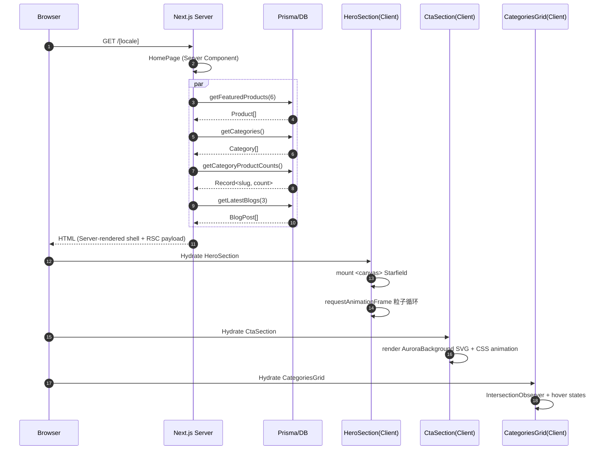
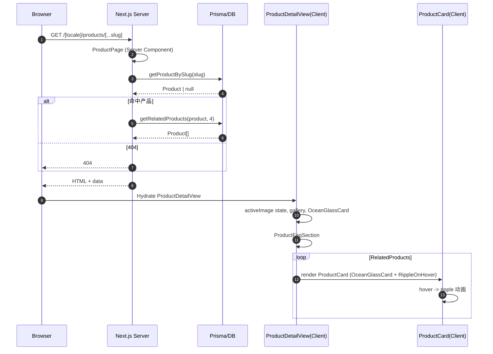
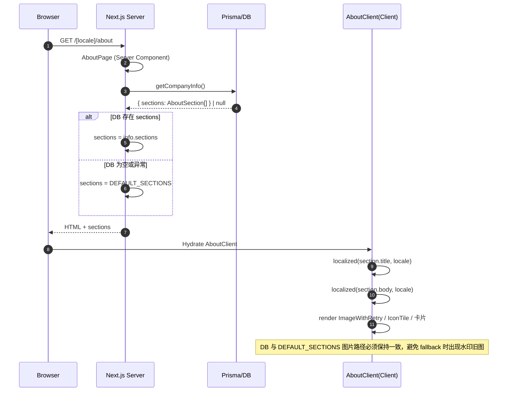

# QtechVending V30 改版系统设计与任务分解

> 设计角色：高见远（架构师）  
> 项目：qtechvending.com V30 多语言营销站  
> 版本：设计稿，不写代码/不改文件，仅做设计+任务分解

---

## 1. 实现方案 + 框架选型

### 1.1 技术栈（沿用现有）

| 层级 | 选型 | 说明 |
|------|------|------|
| 框架 | Next.js 14.2.35 App Router | 多语言 SEO、Server Components 取数、Client Components 交互 |
| 语言 | TypeScript 5.6 | 全类型安全 |
| 样式 | Tailwind CSS 3.4 + `@tailwindcss/typography` | 设计系统原子化，易于 RTL |
| 图标 | lucide-react 0.456 | 无需额外图标库 |
| 数据 | Prisma 6.2 + PostgreSQL | 现有 `products/categories/company_info` 结构不变 |
| 动画 | 纯 CSS / SVG / Canvas | **不新增 framer-motion、three.js、GSAP 等重型依赖** |
| 脚本 | Python（Pillow 12.2 + OpenCV 5.0）+ tsx | 视频抽帧、图片转 WebP；DB 写入走 tsx+Prisma |

### 1.2 动画实现方案

| 视觉需求 | 实现方式 | 降级策略 |
|----------|----------|----------|
| 首页 Hero 夜幕繁星 | `<canvas>` 粒子系统：80-120 颗星，3 层景深，sine 缓动明灭，缓慢漂移 | `prefers-reduced-motion` 时静态星空或隐藏画布 |
| 首页底部 CTA 极光 | SVG `<linearGradient>` + `<path>` + CSS `transform`/`opacity` 流动，纯 GPU 层 | reduced-motion 下显示静态渐变背景 |
| 卡片/图标多彩质感 | Tailwind 渐变、内阴影、异形 `border-radius`、CSS `group-hover` 过渡 | 无动画依赖，reduced-motion 仅去除悬浮微动 |
| 产品卡片水波纹 | CSS `radial-gradient` 伪元素 + `mask` 扩散；可选指针驱动 JS 设置 `--ripple-x/y` | reduced-motion 时关闭扩散动画 |
| 入场动画 | 现有 `RevealOnScroll`（IntersectionObserver + CSS `reveal-up`）复用 | 统一在 `prefers-reduced-motion` 下立即显示 |

### 1.3 架构模式

- **App Router Server Components**：`page.tsx` 中调用 `src/lib/data.ts` 的 Prisma 函数，完成 SEO 与首屏数据。
- **Client Components ('use client')**：Canvas/SVG/交互/状态（Hero、CTA、卡片、Carousel）。
- **数据层**：`src/lib/data.ts` 已经封装 Prisma，所有查询 try/catch 降级，保持现有 API 不变。
- **设计系统**：颜色/阴影/动画 keyframes 集中在 `tailwind.config.ts` + `src/app/globals.css`，新组件通过 Tailwind 类组合。
- **RTL**：阿拉伯语方向使用 `dir='rtl'`，所有箭头/顺序敏感样式使用 `rtl:-scale-x-100` 与 `rtl:group-hover:-translate-x-1`。

### 1.4 核心挑战与对策

1. **产品目录从文档干净重建**：用脚本解析 `docx_all.txt` 与 `产品图和资料/` 文件夹，按用户给定的 slug 映射硬编码，删除旧 `helmet-washing`。
2. **关于我们图片水印**：已确认 `public/images/about/factory-*.png` 带「图片由AI生成」水印，用资料文件夹中的官方车间/外观/历史图替换，统一转 WebP 并更新 DB。
3. **视频抽帧**：服务器无 ffmpeg，使用 OpenCV 按帧读取，取中间帧输出 WebP，避免转码依赖。
4. **性能**：Canvas 星空帧率控制在 30fps，避免 Retina 上 starCount 过多；极光使用 CSS 动画而非 JS 重绘。
5. **部署一致性**：所有新增图片必须 `git add`，因为 `next start` 对 `public/` 是启动快照；DB 图片路径与 WebP 路径同步更新。

---

## 2. 文件清单及相对路径

### 2.1 设计系统 / 共享基元（新建/升级）

- `tailwind.config.ts`：新增 `ocean` 色系、`shadow-ocean`、`ocean-gradient` 等 token。
- `src/app/globals.css`：新增 `starfield`、`aurora`、`ocean-glass`、`ripple`、`icon-float`、`icon-shimmer` 等动画/组件类；统一 `prefers-reduced-motion` 规则。
- `src/components/ui/IconTile.tsx`：升级；新增 `variant`/`animate`/`shape` 等 API，支持多彩异形。
- `src/components/ui/Starfield.tsx`：新建；夜幕星空 Canvas 组件。
- `src/components/ui/AuroraBackground.tsx`：新建；极光 SVG 背景组件。
- `src/components/ui/RippleOnHover.tsx`：新建；指针驱动或 CSS 径向水波纹容器。
- `src/components/ui/OceanGlassCard.tsx`：新建；海洋玻璃卡片基元，支持 `depth`/`ripple`/`hoverLift`。

### 2.2 首页视觉改造

- `src/components/home/HeroSection.tsx`：改造；使用 `Starfield` 背景、多彩玻璃态信任卡片、保留真实产品主图。
- `src/components/home/CtaSection.tsx`：改造；使用 `AuroraBackground` 极光、高质感 CTA 玻璃面板。
- `src/components/home/CategoriesGrid.tsx`：改造；分类卡片多彩、异形、微动效。
- `src/components/home/AdvantagesSection.tsx`：改造；更丰富的特性瓦片（渐变、图标自发光、数字水印）。
- `src/components/home/StatsBand.tsx`：改造；stat chip 多彩、顶部分割线、悬停浮起。
- `src/components/home/PartnersSection.tsx` → **删除/重构为 `src/components/home/CasesSection.tsx`**：用视频抽帧作为合作案例图。
- `src/app/[locale]/page.tsx`：引入 `CasesSection` 替换 `PartnersSection`。

### 2.3 产品系统海洋主题改造

- `src/components/products/ProductCard.tsx`：改造；使用 `OceanGlassCard` + `RippleOnHover`。
- `src/app/[locale]/products/[...slug]/ProductDetailView.tsx`：改造；画廊、规格表、相关推荐均使用海洋玻璃风格。
- `src/app/[locale]/products/ProductsClient.tsx`：适配；列表容器、筛选栏样式与海洋主题一致。
- `src/components/products/FilterBar.tsx`：适配；玻璃态筛选胶囊、选中态发光。
- `public/images/products/<slug>/1..N.webp`：重建。

### 2.4 关于我们与文案补全

- `src/app/[locale]/about/page.tsx`：修改 `DEFAULT_SECTIONS`；图片路径改为 `.webp` 官方图；与 DB `company_info.sections` 保持一致。
- `src/app/[locale]/about/AboutClient.tsx`： richer 布局；公司介绍、制造流程、案例、时间线、证书等使用升级后的卡片。
- `src/messages/en.json`：首页 Hero/CTA/关于/案例文案补全。
- `src/messages/zh.json`：同上。
- `src/messages/ar.json`：同上（待人工校对，但脚本先生成占位）。

### 2.5 数据 / 资产重建脚本（不走代码逻辑，但需设计文件）

- `scripts/rebuild-products.ts`：读取 `docx_all.txt` 与 `产品图和资料/`，按给定 slug 映射重建 20 产品 + 10 分类；删除 `helmet-washing`。
- `scripts/update-company-info.ts`：将更丰富的 `AboutSection[]` 写入 `company_info(slug='main').sections`。
- `scripts/convert-images.py`：Pillow 批量转 WebP q82；输入资料夹/当前 `public/images`，输出覆盖到 `public/images`。
- `scripts/extract-video-frames.py`：OpenCV 读取 8 个视频，抽中间帧（或关键帧），生成 `public/images/cases/<name>.webp`。
- `scripts/qa-images.mjs`：可选；检查 WebP 路径是否存在于 `public/images`，输出缺失/损坏清单。

### 2.6 类型/数据层（基本不变）

- `src/types/index.ts`：补充 `OceanGlassCardProps`、`StarfieldProps` 等 UI 类型（可选）。
- `src/lib/data.ts`：无需修改，仍提供 `getProducts`/`getProductBySlug`/`getFeaturedProducts`/`getCompanyInfo`。
- `prisma/schema.prisma`：无需修改，继续用 `products`/`categories`/`company_info`。

---

## 3. 数据结构与接口

### 3.1 核心数据类型

```typescript
// 多语言字段（与 Prisma Json 对应）
interface I18nString {
  en?: string;
  zh?: string;
  ar?: string;
  [key: string]: string | undefined;
}

interface I18nStringList {
  en?: string[];
  zh?: string[];
  ar?: string[];
  [key: string]: string[] | undefined;
}

interface ProductSpec {
  param: string;
  value: string;
}

interface Category {
  id: string;
  slug: string;
  name: I18nString;
  icon?: string;
  description?: I18nString;
  order: number;
  status: 'active' | 'inactive';
  type: 'product';
  products?: Product[];
}

interface Product {
  id: string;
  slug: string;
  sku: string;
  name: I18nString;
  displayTitle?: I18nString;
  description?: I18nString;
  shortDescription?: I18nString;
  images: string[];          // e.g. ['/images/products/<slug>/1.webp']
  features?: I18nStringList;
  specs?: ProductSpec[];
  status: 'active' | 'inactive';
  featured: boolean;
  order: number;
  relatedProducts: string[]; // product ids
  seoTitle?: I18nString;
  seoDescription?: I18nString;
  seoKeywords?: I18nString;
  categories: Category[];
}

interface AboutSection {
  key: 'story' | 'mission' | 'vision' | 'capability' | 'milestones' | 'values' | 'cases' | string;
  title: I18nString;
  body: I18nString;
  image?: string;            // e.g. '/images/about/factory-assembly.webp'
}

interface CompanyInfo {
  id: string;
  slug: 'main';
  sections: AboutSection[];
}

interface Paginated<T> {
  data: T[];
  total: number;
  totalPages: number;
  page: number;
  pageSize: number;
}

interface ProductQuery {
  categories?: string[];
  search?: string;
  page?: number;
  pageSize?: number;
  sort?: 'featured' | 'newest' | 'name';
}
```

### 3.2 服务层接口（src/lib/data.ts）

```typescript
// 所有函数保持现有签名，返回已定义类型，异常时返回空数组/对象/null
async function getCategories(): Promise<Category[]>;
async function getCategoryProductCounts(): Promise<Record<string, number>>;
async function getFeaturedProducts(limit?: number): Promise<Product[]>;
async function getProducts(query?: ProductQuery): Promise<Paginated<Product>>;
async function getAllProductSlugs(): Promise<string[]>;
async function getProductBySlug(slug: string): Promise<Product | null>;
async function getRelatedProducts(product: Product, limit?: number): Promise<Product[]>;
async function getCategoryBySlug(slug: string): Promise<Category | null>;
async function getCompanyInfo(): Promise<CompanyInfo | null>;
```

### 3.3 新增 UI 组件接口

```typescript
// 星空背景
interface StarfieldProps {
  className?: string;
  starCount?: number;      // 默认 ~100
  speed?: number;          // 漂移速度
  depth?: boolean;         // 是否开启景深视差
  twinkle?: boolean;       // 是否闪烁
  reduced?: boolean;       // 外部传入 reduced-motion 状态
}

// 极光背景
interface AuroraBackgroundProps {
  className?: string;
  colors?: string[];       // 默认 ['#06b6d4','#0891b2','#0e7490']
  reduced?: boolean;
}

// 图标容器（升级）
interface IconTileProps {
  icon: LucideIcon;
  className?: string;
  tileClassName?: string;
  size?: number;
  variant?: 'default' | 'gradient' | 'glossy' | 'float' | 'hex';
  animate?: false | 'pulse' | 'bounce' | 'shimmer';
}

// 水波纹容器
interface RippleOnHoverProps {
  children: React.ReactNode;
  className?: string;
  pointerDriven?: boolean; // true=鼠标落点；false=中心径向
  rippleColor?: string;    // 默认 'rgba(255,255,255,0.35)'
  reduced?: boolean;
}

// 海洋玻璃卡片
interface OceanGlassCardProps {
  children: React.ReactNode;
  className?: string;
  depth?: 'sm' | 'md' | 'lg';   // 控制 blur / shadow 强度
  hoverLift?: boolean;
  ripple?: boolean;
  reduced?: boolean;
}

// 合作案例项
interface CaseItem {
  image: string;           // e.g. '/images/cases/feedback-video.webp'
  title: I18nString;
  sub: I18nString;
  video?: string;          // 可选：原视频 URL，用于 lightbox
}
```

### 3.4 Mermaid 类图



---

## 4. 程序调用流程

### 4.1 首页加载流程



### 4.2 产品页加载流程



### 4.3 关于我们加载流程（DB 驱动 vs 代码回退）



---

## 5. Anything UNCLEAR（不确定点与假设）

1. **产品标题来源**：假设 `docx_all.txt` 中已包含每个产品的英文标题，脚本按用户给定的 slug→model 映射重建；如 docx 标题不完整，需要产品/项目经理提供补齐。
2. **CasesSection 与 PartnersSection 关系**：当前 `PartnersSection` 使用产品图作为「部署案例」。设计假设用新建的 `CasesSection` 替换 `PartnersSection`，以视频抽帧作为真实合作案例。如业务方希望两者并存，则改为在 `PartnersSection` 下方新增 `CasesSection`。
3. **all-machines 分类**：假设仅作为导航「查看全部」别名保留在前端，不在 DB 新建 `all-machines` Category；当前 `public/images/categories/all-machines.png` 保留。
4. **证书图**：当前 `public/images/about/certificate-*.svg` 是矢量图，无 AI 水印。是否替换为资料夹里的 `证书.png` 由业务方决定；设计建议保留 SVG（清晰、轻量），或新增一张真实证书总览图作为补充。
5. **阿拉伯语文案**：`ar` 版本可由脚本基于 `en` 生成占位，上线前需人工校对。设计已预留 `I18nString` 三语字段。
6. **产品图片数量**：假设每个产品取 1-4 张官方图（资料夹中常见 1-5 张），脚本自动按顺序命名为 `1.webp`, `2.webp`…；如无足够图片，fallback 用分类图。

---

## 6. 依赖包列表

**尽量零新增运行时依赖**。当前 `package.json` 已覆盖全部需求：

| 包 | 用途 | 是否新增 |
|----|------|---------|
| `next@^14.2.18` | 框架 | 否 |
| `react@^18.3.1` / `react-dom@^18.3.1` | UI 运行时 | 否 |
| `tailwindcss@^3.4.15` / `autoprefixer` / `postcss` | 样式 | 否 |
| `@tailwindcss/typography` | 长文排版 | 否 |
| `lucide-react@^0.456.0` | 图标 | 否 |
| `@prisma/client@^6.2.0` / `prisma@^6.2.0` | ORM | 否 |
| `tsx@^4.19.2` | 运行 TS 脚本 | 否（dev） |

**如需新增（可选）**：
- `python-docx`（如用 Python 解析 `.docx`；当前已有 `docx_all.txt` 可不用）。
- 本地 Python 虚拟环境：`Pillow` + `opencv-python`，已提供，无需 npm install。

**不引入**：framer-motion、three.js、gsap、@react-bits、lenis 等。

---

## 7. 任务列表（按依赖顺序）

| 任务 ID | 任务名称 | 涉及文件 | 依赖 | 优先级 |
|---------|----------|----------|------|--------|
| **T01** | **项目基础设施与设计系统** | `tailwind.config.ts`<br>`src/app/globals.css`<br>`src/components/ui/IconTile.tsx`<br>`src/components/ui/Starfield.tsx`<br>`src/components/ui/AuroraBackground.tsx`<br>`src/components/ui/RippleOnHover.tsx`<br>`src/components/ui/OceanGlassCard.tsx` | 无 | P0 |
| **T02** | **数据资产与内容重建** | `scripts/rebuild-products.ts`<br>`scripts/update-company-info.ts`<br>`scripts/convert-images.py`<br>`scripts/extract-video-frames.py`<br>`prisma/seed.ts`（或新建 `prisma/update-content.ts`）<br>`public/images/products/**/*.webp`<br>`public/images/about/**/*.webp`<br>`public/images/cases/*.webp` | 无（逻辑上先于 T04/T05） | P0 |
| **T03** | **首页视觉系统改造** | `src/components/home/HeroSection.tsx`<br>`src/components/home/CtaSection.tsx`<br>`src/components/home/CategoriesGrid.tsx`<br>`src/components/home/AdvantagesSection.tsx`<br>`src/components/home/StatsBand.tsx`<br>`src/components/home/PartnersSection.tsx` / `CasesSection.tsx`<br>`src/app/[locale]/page.tsx`<br>`src/components/ui/RevealOnScroll.tsx` | T01 | P0 |
| **T04** | **产品系统海洋主题改造** | `src/components/products/ProductCard.tsx`<br>`src/app/[locale]/products/[...slug]/ProductDetailView.tsx`<br>`src/app/[locale]/products/ProductsClient.tsx`<br>`src/components/products/FilterBar.tsx`<br>`public/images/products/**/*.webp` | T01、T02 | P0 |
| **T05** | **关于我们与案例集成** | `src/app/[locale]/about/page.tsx`<br>`src/app/[locale]/about/AboutClient.tsx`<br>`src/components/home/CasesSection.tsx`<br>`src/messages/en.json`<br>`src/messages/zh.json`<br>`src/messages/ar.json` | T01、T02 | P0 |

**说明**：
- T01 是所有视觉改造的前置，提供统一的颜色、动画、组件基元。
- T02 是所有数据/资产前置，脚本跑完后 T04/T05 才有正确图片和 DB 内容。
- T03/T04/T05 可并行开发，只要 T01/T02 完成。
- 所有图片产出必须 **git-tracked**，避免 `next start` 后出现 400。

---

## 8. Shared Knowledge（跨文件约定）

### 8.1 颜色 token（Tailwind 扩展）

```typescript
// tailwind.config.ts 扩展
{
  ocean: {
    50: '#f0fdfa',
    100: '#ccfbf1',
    200: '#99f6e4',
    300: '#5eead4',
    400: '#2dd4bf',
    500: '#14b8a6',
    600: '#0d9488',
    700: '#0f766e',
    800: '#115e59',
    900: '#134e4a',
    950: '#042f2e',
  },
  // 新增阴影
  boxShadow: {
    'ocean': '0 12px 40px -12px rgba(13,148,136,0.35)',
    'ocean-lg': '0 24px 60px -16px rgba(13,148,136,0.45)',
  },
  backgroundImage: {
    'ocean-gradient': 'linear-gradient(135deg, rgba(20,184,166,0.25) 0%, rgba(6,182,212,0.15) 50%, rgba(59,130,246,0.20) 100%)',
  }
}
```

### 8.2 动画 class 命名

| class | 作用 |
|-------|------|
| `.starfield` | Hero 画布容器 |
| `.starfield--reduced` | 静态星空（prefers-reduced-motion） |
| `.aurora` | 极光 SVG 容器 |
| `.aurora--reduced` | 静态渐变 |
| `.ocean-glass` | 海洋玻璃卡片基础 |
| `.ocean-glass--sm/md/lg` | 不同模糊/阴影强度 |
| `.ripple` | 悬停时 radial 扩散 |
| `.ripple--reduced` | 关闭扩散 |
| `.icon-float` | 图标轻柔上下浮动 |
| `.icon-shimmer` | 图标光泽扫过 |
| `.reveal-up` / `.is-visible` | 入场动画（已存在） |

### 8.3 prefers-reduced-motion 统一处理

```css
@media (prefers-reduced-motion: reduce) {
  .starfield, .aurora, .ripple, .icon-float, .icon-shimmer {
    animation: none !important;
  }
  .ripple { opacity: 0 !important; }
  .starfield { opacity: 0.6; } /* 保留静态星空但降低亮度 */
  .aurora { opacity: 0.8; }     /* 保留静态极光渐变 */
  .reveal-up { opacity: 1 !important; transform: none !important; }
}
```

组件内部也允许传 `reduced` prop，由父组件通过 `window.matchMedia('(prefers-reduced-motion: reduce)')` 读取一次后传入。

### 8.4 OceanGlass 设计规范

- 背景：`bg-gradient-to-br from-cyan-500/10 to-blue-600/10` + `backdrop-blur-md`。
- 边框：`border border-white/20` + `border-t-white/30`（高光）。
- 阴影：`shadow-ocean`。
- 悬停：`hover:-translate-y-1 hover:shadow-ocean-lg`。
- 水波纹：伪元素 `::after` 使用 `radial-gradient(circle, rgba(255,255,255,0.35), transparent 60%)`，从 hover 中心扩散。
- 文字：内部标题 `text-ink-900`，副文 `text-ink-600`，强调色 `text-ocean-700`。

### 8.5 图片路径约定

- 产品图：`/images/products/<slug>/<n>.webp`
- 关于我们：`/images/about/<key>.webp`（如 `factory-assembly.webp`）
- 案例图：`/images/cases/<video-name>.webp`
- 分类图：`/images/categories/<category-slug>.webp`
- 所有 DB 字段与代码 fallback 必须使用同一路径，确保 DB 为空时也不回退到旧水印 PNG。

### 8.6 RTL 约定

- 所有箭头图标：`className="rtl:-scale-x-100"`。
- 所有 `group-hover:translate-x-1` 的容器：同时写 `rtl:group-hover:-translate-x-1`。
- 水平滚动/轮播：使用 `dir` 感知滚动（`scrollIntoView({inline:'start'})` 已支持）。

---

## 9. 风险点

| 风险 | 影响 | 对策 |
|------|------|------|
| **AI 水印图未完全替换** | 关于我们页面出现「图片由AI生成」水印 | 明确列出 4 张目标 PNG；替换后脚本批量 WebP 化；DB `company_info.sections` 与 `DEFAULT_SECTIONS` 同步改路径；QA 检查所有 about 图片 |
| **视频抽帧质量不稳定** | 案例图黑屏/模糊/人物不全 | 不使用 ffmpeg，用 OpenCV 读取总帧数后取 40%-60% 区间帧；对每个视频抽 3 帧候选，人工/脚本选最亮、最清晰的一帧；fallback 用资料夹里的 `合作案例.png` |
| **星空/极光性能开销** | 低端机掉帧、耗电 | Canvas 星空 30fps、粒子数按 DPR 与屏宽动态减少；极光使用 CSS 变换而非 JS；reduced-motion 时直接静态化 |
| **关于我们 DB 与代码回退不一致** | DB 为空时 fallback 到旧水印图 | 更新 `DEFAULT_SECTIONS` 的图片路径与 DB 一致；部署前先跑 `update-company-info.ts` 写入 DB；上线后验证 DB 非空 |
| **slug 删除 helmet-washing 的连带影响** | 旧外链 404、相关推荐异常、图片目录残留 | 脚本删除 DB 记录及 `public/images/products/...helmet-washing.../`；检查 `next.config` rewrite/redirect 是否无需特殊处理；QA 确认没有硬编码引用 |
| **图片未 git-tracked** | `next start` 后 scp 图片 400 | 所有图片必须进入仓库；部署脚本使用 `git reset --hard origin/main` 拉取；新增图片后必须 `pm2 restart` |
| **WebP 转换后 sharp 不兼容** | 构建或运行时图片处理失败 | 用 Pillow 转 WebP（质量 82），避免直接写有损 WebP 的极端参数；本地 `next dev` 验证图片能正常显示 |
| **产品文案从文档抽取不完整** | 产品页内容单薄 | 脚本解析 `docx_all.txt` 时，按分类文件夹和产品标题建立映射；无法抽取的参数由工程师人工复核补全 |

---

## 10. 关于我们「ai生成图片」水印排查结果

### 10.1 排查方法

1. 查看 `src/app/[locale]/about/AboutClient.tsx` 与 `src/app/[locale]/about/page.tsx` 中所有图片引用。
2. 对 `public/images/about/` 下的 PNG 文件逐一视觉检查。
3. 已确认以下 4 张 PNG 右下角带有白色半透明水印 **「图片由AI生成」**：

### 10.2 疑似/已确认带水印文件

| 文件名 | 在页面中的用途 | 来源判断 | 风险等级 |
|--------|----------------|----------|---------|
| `public/images/about/factory-assembly.png` | DEFAULT_SECTIONS story 图、COMPANY_INTRO 主图、MANU_CARDS[0] 装配线、WORKSHOP 画廊 | AI 生成，带水印 | **高** |
| `public/images/about/factory-qc.png` | MANU_CARDS[2] 质检、WORKSHOP 画廊 | AI 生成，带水印 | **高** |
| `public/images/about/factory-rnd.png` | MANU_CARDS[1] 研发、WORKSHOP 画廊 | 同系列 AI 生成，高度疑似带水印 | **高** |
| `public/images/about/factory-warehouse.png` | MANU_CARDS[3] 物流、WORKSHOP 画廊 | 同系列 AI 生成，高度疑似带水印 | **高** |
| `public/images/about/capability.svg` | 未在代码中使用（代码引用的是 `capabilities.svg`） | 矢量插图，非 AI 照片 | 低 |
| `public/images/about/capabilities.svg` | DEFAULT_SECTIONS capability 图 | 矢量插图，非 AI 照片 | 低 |
| `public/images/about/mission.svg` | DEFAULT_SECTIONS mission 图 | 矢量插图 | 低 |
| `public/images/about/vision.svg` | DEFAULT_SECTIONS vision 图 | 矢量插图 | 低 |
| `public/images/about/certificate-*.svg` | 证书画廊 | 矢量插图 | 低 |
| `public/images/about/company.svg` | 未使用 | 矢量插图 | 低 |

### 10.3 替换方案

**官方素材来源**：`C:\Users\Administrator\Desktop\网站建设资料\网站建设资料\网站介绍\公司介绍\`

| 目标 WebP 文件 | 建议替换源 | 用途对应 |
|----------------|------------|----------|
| `public/images/about/factory-assembly.webp` | `工厂车间图.png` | 装配线、车间概览、公司介绍主图 |
| `public/images/about/factory-rnd.webp` | `公司外观图.png` 或 `公司介绍图.png` | 研发中心 / 公司形象 |
| `public/images/about/factory-qc.webp` | `工厂车间图.png`（裁剪/不同角度） | 质检车间 |
| `public/images/about/factory-warehouse.webp` | `工厂车间图.png` 或 `公司外观图.png` | 物流/仓储 |
| `public/images/about/company-overview.webp` | `公司介绍图.png` | 公司介绍主图（可选新增） |
| `public/images/about/company-history.webp` | `公司历史图.png` | 时间线/历史板块（可选新增） |
| `public/images/cases/partnership.webp` | `合作.jpeg` / `合作案例.png` | CasesSection 总览图 |

**执行步骤**：
1. 用 `scripts/convert-images.py` 将官方 PNG/JPEG 转为 WebP（质量 82）。
2. 删除旧 `factory-*.png`，新增 `factory-*.webp` 等。
3. 运行 `scripts/update-company-info.ts` 将 `company_info.sections` 的 `image` 更新为 `.webp` 路径。
4. 同步修改 `src/app/[locale]/about/page.tsx` 中 `DEFAULT_SECTIONS` 的 `image` 字段，确保 DB 为空时也不回退到水印 PNG。
5. 在 `AboutClient.tsx` 中同步更新 `MANU_CARDS` / `WORKSHOP` / `COMPANY_INTRO.image` 路径。
6. `git add` 所有新图片，部署后 `pm2 restart`。

### 10.4 建议新增的关于我们板块

基于资料夹内容，可在 `company_info.sections` 中补充：
- `story`：工厂实景 + 公司介绍图
- `milestones`：公司历史图 + 时间线
- `certificates`：证书图（或保留 SVG）
- `cases`：合作案例图 + 视频抽帧案例

---

## 附录：Mermaid 图独立文件

- `docs/class-diagram.mermaid`：从第 3.4 节提取的类图。
- `docs/sequence-diagram.mermaid`：从第 4 节提取的三段时序图。
